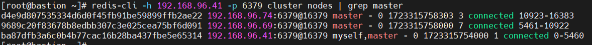
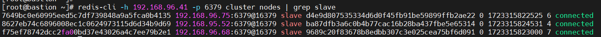
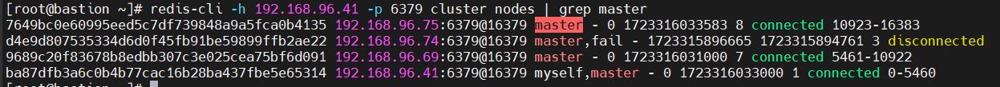

**Redis Master-Slave set-up on Six Virtual Machines: A High-Availability and Scalable Deployment**

Name: Sumit Padiyar

Gmail: padiyarsumit09@gmail.com

**Overview of Redis:**

Redis (Remote Dictionary Server) is an open-source, in-memory data structure store that is widely used as a database, cache, and message broker. Redis supports various data structures such as strings, lists, sets, hashes, and sorted sets, along with bitmaps, hyperloglogs, and geospatial indexes. It is known for its high performance, flexibility, and ease of use. Redis is often used for real-time applications where speed is crucial, such as caching, session management, real-time analytics, and message queuing.

**Benefits and Drawbacks of Redis:**

**Benefits :**

- **High Speed**: Redis operates entirely in memory, providing extremely fast read and write operations.
- **Versatile Data Structures**: Redis supports a wide range of data types, allowing for flexible data modelling.
- **Persistence**: It offers the ability to persist data to disk, ensuring durability in addition to in-memory storage.
- **Scalability**: With support for clustering and sharding, Redis can scale horizontally across multiple nodes.
- **Ease of Use**: Redis features a straightforward API and simple configuration, making it easy to deploy and manage.

**Drawbacks :** 

- **Memory Consumption:** As an in-memory store, Redis can require significant RAM, which can be expensive.
- **Limited Query Capabilities:** Unlike traditional relational databases, Redis lacks support for complex queries and joins.
- **Single-threaded Execution:** Redis operates on a single-threaded model, which might be limiting for write-heavy applications.
- **Risk of Data Loss:** Without proper configuration for persistence, Redis can risk data loss during server crashes.

**Redis Compared to Other Databases:**

Redis distinguishes itself from traditional databases in several ways:

- **In-Memory Storage**: Unlike databases such as MySQL or PostgreSQL that rely on disk storage, Redis stores data in memory, resulting in much faster data operations.
- **Advanced Data Structures**: Redis natively supports complex data types, unlike many other databases.
- **Persistence Options**: Redis can be used both as a cache with optional persistence and as a durable database.
- **Single-threaded Nature**: In contrast to multi-threaded databases like MongoDB, Redis processes commands in a single thread, which simplifies concurrency control.
- **Use Case Focus**: Redis is typically used in scenarios requiring high-speed data processing, such as caching and real-time analytics, while traditional databases are often employed for more complex transactional tasks.

**Key Functionalities of Redis:**

- **In-Memory Processing**: Facilitates extremely fast data access by keeping the entire dataset in memory.
- **Persistence Mechanisms**: Includes both RDB snapshots and AOF (Append-Only File) logs to persist data.
- **Replication**: Supports master-slave replication, enabling high availability.
- **Clustering**: Allows horizontal scaling by distributing data across multiple nodes.
- **Pub/Sub Messaging**: Implements publish/subscribe messaging for real-time communication.
- **Atomic Transactions**: Supports atomic execution of multiple commands using the MULTI command.
- **Lua Scripting**: Provides the ability to execute custom scripts within the server.
- **Geospatial Support**: Offers native support for geospatial data handling and queries.
- **Stream Management**: Enables the creation and handling of data streams, useful for event logging.

## **Prerequisites for Deploying Redis on Red Hat Linux:**
Before deploying Redis on a Red Hat Linux system, certain prerequisites must be met:

- **Operating System Compatibility**: Redis is compatible with Red Hat Enterprise Linux (RHEL) versions 7 and 8.
- **Administrative Privileges**: Root or sudo access is necessary for installation and configuration.
- **Firewall Settings**: Ensure the firewall allows traffic on Redis's default port (6379).
- **SELinux Configuration**: If SELinux is enforced, it must be configured to permit Redis operations.

**Licensing Options Available for Redis:**

Redis is distributed under two primary licensing models:

**Redis Source-Available License (RSAL)**: The core of Redis is licensed under RSAL, allowing free use and distribution with certain restrictions for cloud providers offering Redis as a service.

**Redis Enterprise License**: Advanced features of Redis are available under a commercial license, including capabilities such as Redis on Flash, active-active geo-distribution, and enterprise-grade support.
## **Tools Provided by Redis and Their Applications:**
Redis offers several tools that facilitate its deployment and management:

- **Redis CLI (redis-cli)**: A command-line tool for interacting with Redis servers, executing commands, and managing keys.
- **Redis Sentinel**: A high-availability tool that monitors Redis instances, provides notifications, and handles automatic failover in case of master failure.
- **Redis Cluster**: A tool for sharding data across multiple Redis nodes, enabling scalability and distributed data management.
- **RedisI nsight**: A graphical interface for visualising Redis data, monitoring performance, and debugging issues.

## **Redis Architecture Overview:**
In this Redis deployment, I have set up a master-slave architecture across six virtual machines (VMs). This architecture is designed to ensure high availability, data redundancy, and scalability.

- **Network Topology:**

**Masters:**

- **192.168.96.41**
- **192.168.96.68**
- **192.168.96.74**

**Slaves:**

- **192.168.95.52**
- **192.168.96.69**
- **192.168.96.75**

- **Master-Slave Configuration:** 
  - **Master Nodes:** The Redis instances running on 192.168.96.41, 192.168.96.68, and 192.168.96.74 act as the primary databases. They handle all write operations and propagate data changes to their respective slaves.
  - **Slave Nodes:** The instances on 192.168.95.52, 192.168.96.69, and 192.168.96.75 are configured as slaves. Each slave is paired with a master and receives a continuous stream of replication data from its master.** 

**In this setup:**

- The slave on **192.168.95.52** replicates data from the master at **192.168.96.41.**
- The slave on **192.168.96.69** replicates data from the master at **192.168.96.68.**
- The slave on **192.168.96.75** replicates data from the master at **192.168.96.74.**
###
- ### **Data Replication:**
  - **Asynchronous Replication**: In your setup, Redis performs asynchronous replication, meaning the master node sends updates to the slaves after the data is written to the master. This ensures fast write performance but may result in a slight delay before data is available on the slaves.
  - **Slave Read Operations**: Typically, read operations can be offloaded to slave nodes to distribute the load and increase overall throughput. This makes the system more efficient by balancing the load between master and slave nodes.

- **High Availability:**
  - **Automatic Failover:** In case of a master failure, the Redis system can be configured to automatically promote one of the slaves to become the new master. This process can be managed by Redis Sentinel, which monitors the health of the master nodes and handles the failover process.

- ### **Clustering and Scalability:**
  Although your setup is a master-slave configuration, Redis also supports clustering, where data is shared across multiple nodes. In this particular setup, each master-slave pair can be viewed as an independent shard, and the architecture could be extended into a clustered setup if more horizontal scaling is required.

- **Security and Network Configuration:**
  - **Firewall Settings:** Each VM should be configured to allow Redis traffic (typically on port 6379) between the master and its corresponding slave. Network security groups or firewalls must be configured to permit this communication while restricting unauthorised access.
  - **Authentication:** If security is a concern, Redis instances can be configured to require authentication, and data encryption can be applied to secure communication between the nodes.

**Steps to set up Redis master slave servers:**
### **Step 1: Installing Redis on All Nodes**

|# dnf module install redis|
| :- |

Next, start the Redis service, enable it to automatically start at system boot and check its status to verify that it is running (verify the service on all the 6 instances):

|# systemctl start redis # systemctl enable redis # systemctl status redis|
| :- |

**Step 2: Configuring Redis Instances on all Nodes:**

|# vi /etc/redis.conf|
| :- |

Next, find the following configuration parameters and edit their values as shown. The bind parameter sets the interface of the Redis server will listen on, set its value to the instance LAN IP. Remove the 127.0.0.1 because we realized leaving it there slows down the process of cluster creation, particularly the stage of joining the cluster.

|bind  192.168.96.41|
| :- |

Then set the protected-mode to no to allow connections from the other instances on the cluster.

|protected-mode no|
| :- |

The port parameter defines the port the Redis server will listen on for connections, the default is 6379. This is the data port for communicating with clients.

|port 6379|
| :- |

The next set of parameters will enable the cluster mode and set some of its useful features. The cluster-enabled parameter, when set to yes, activates the cluster mode.

|cluster-enabled yes|
| :- |

Next, the cluster-config-file parameter sets the name of a cluster node’s cluster configuration file (e.g nodes-6379.conf). The file is created in the working directory (default is /var/lib/redis defined using the dir parameter) and is not user editable.

|cluster-config-file nodes-6379.conf|
| :- |

The next useful cluster option is cluster-node-timeout, it is used to set the maximum amount of time in milliseconds an instance can be unavailable for it to be considered in a failure state. A value of 15000 is equivalent to 15 seconds.

|cluster-node-timeout 15000|
| :- |

We also need to enable Redis persistence on disk. We can use one of the persistence modes, that is the Append Only File (AOF): it logs (in the file appendonly.aof created under the working directory) every write operation successfully received by the server. The data will be played during the server startup to reconstruct the original dataset. To enable it, set the appendonly parameter to yes.

|appendonly yes|
| :- |

After making all the changes, restart the Redis service on all the nodes to apply the recent changes.

|# systemctl restart redis|
| :- |

Next, open port 6397 and 16379 on all the instances. The later port is used for the cluster bus (a node-to-node communication channel using a binary protocol). This is a basic requirement for the Redis cluster TCP connections.

|# firewall-cmd --zone=public --permanent --add-port=6379/tcp # firewall-cmd --zone=public --permanent --add-port=16379/tcp  # firewall-cmd --reload|
| :- |

**Step 3: Creating the Redis Cluster:**

To create the cluster, use the redis-cli command-line client as follows. The --cluster create enables cluster creation and --cluster-replicas 1 means create one replica per master. 

For our setup which has 6 nodes, we will have 3 masters and 3 slaves.

Note that the first 3 nodes will be considered masters (M) and the next 3 will be considered slaves (S). 

The first slave i.e 192.168.95.52:6379 replicates the first master i.e 192.168.96.41:6379, the second slave replicates the second master, in that order.

|# redis-cli --cluster create 192.168.96.41:6379 192.168.96.68:6379 192.168.96.74:6379 192.168.95.52:6379 192.168.96.69:6379 192.168.96.75:6379 --cluster-replicas 1|
| :- |

Once the cluster creation is successful, run the following command on any host (specify its IP address using the -h flag) to list all cluster nodes.

|redis-cli -h 192.168.96.41 -p 6379 cluster nodes|
| :- |

You should be able to see all the cluster nodes,

**Step 4: Testing Redis Cluster Failover**

In this section, we will demonstrate how to test a cluster failover. First, let’s take note of the masters.

Also, take note of the Redis slaves.

Next, let’s stop the Redis service on one of the master nodes e.g **192.168.96.74** and check all master nodes in the cluster.

| # systemctl stop redis                              |
| # redis-cli -h 192.168.96.74 -p 6379 cluster nodes | grep master |
| :- |

From the following screenshot, you can see that the node **192.168.96.74:6367** is in fail state and its slave **192.168.96.75:6379** has been promoted to master status.

Now let’s start the Redis service once again on the failed node and check all the masters in the cluster.

| # systemctl start redis                              |
| # redis-cli -h 192.168.96.74 -p 6379 cluster nodes | grep master |
| :- |

**192.168.96.75:6379** has been promoted to master.

**192.168.96.74:6379** has been promoted to master.

**Step 5: Testing Data Replication Across the Redis Cluster:**

This last section explains how to verify cluster data replication. We will create a key and value on one of the masters, then try to read it from all the cluster nodes as follows. Use the -c switch to enable cluster support under redis-cli utility and access data in cluster mode.

|
#redis-cli -c -h 192.168.96.41 -p 6379 set name 'sumit padiyar'

#redis-cli -c -h 192.168.96.41 -p 6379 get name

#redis-cli -c -h 192.168.95.52 -p 6379 get name

#redis-cli -c -h 192.168.96.68 -p 6379 get name

#redis-cli -c -h 192.168.96.69 -p 6379 get name

#redis-cli -c -h 192.168.96.74 -p 6379 get name

#redis-cli -c -h 192.168.96.75 -p 6379 get name
|
| :- |

This master-slave architecture ensures a balance of high availability, fault tolerance, and scalability, making it suitable for applications requiring both performance and reliability.

